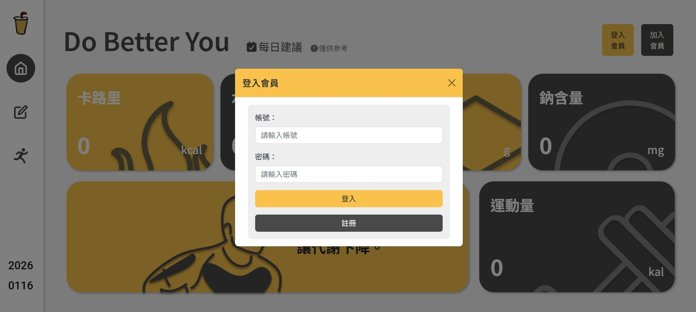
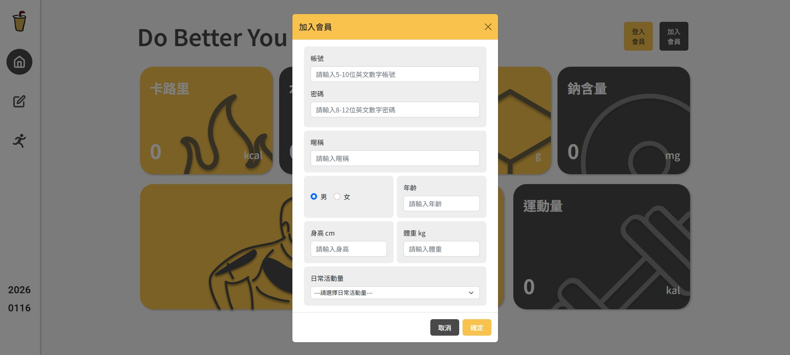
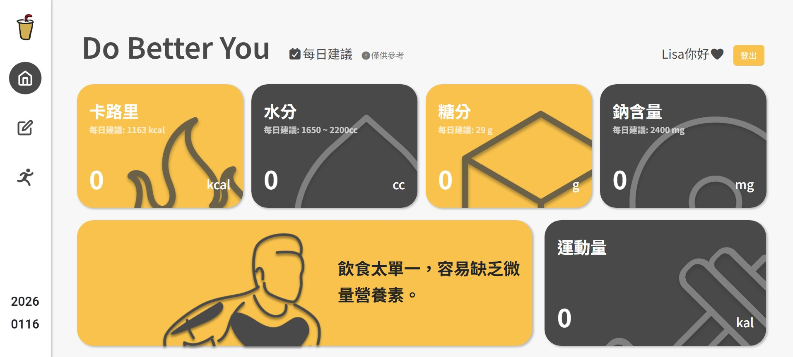
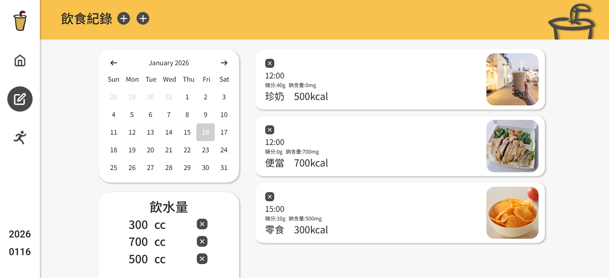
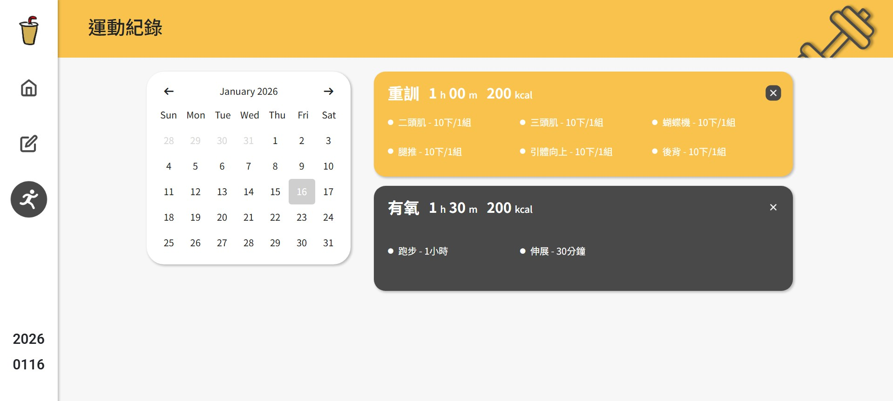

# Fitness

一個以 **健康管理** 為主題的 Web 專題，提供飲食、運動與每日攝水量的紀錄功能，並包含使用者登入與資料管理。

## 📌 Demo 說明
> ⚠️ 本專案為 **PHP + MySQL** 的完整系統。  
> GitHub Pages 僅能展示 **前端 UI**（無法執行 PHP/資料庫功能）。
---

## 🔧 功能介紹

- 使用者註冊 / 登入 / 登出
- 依照使用者的身體指數建議每日攝取量
- 飲食紀錄（新增 / 刪除）
- 運動紀錄管理 (新增 / 刪除)
- 每日攝水量紀錄 (新增 / 刪除)
- 使用 Session 管理登入狀態

---

## 🛠 使用技術

### Frontend
- HTML
- CSS
- Bootstrap
- JavaScript

### Backend
- PHP
- MySQL
- Session Auth
---

## 📁 專案結構（簡述）
```
├─ css/ # 樣式檔
├─ js/ # 前端互動邏輯
├─ images/ # 圖片資源
├─ UML/ # 系統設計圖
├─ *.php # 後端功能（CRUD / Auth）
├─ config.example.php # 範本設定檔
├─ .gitignore
└─ README.md
```
---

## ⚙️ 環境設定（本機執行）

1. 建立 MySQL 資料庫（例：`fitness`）
2. 將 `config.example.php` 複製為 `config.php`
3. 填入資料庫連線資訊（`config.php` 不上傳 GitHub）
4. 將專案放到 `htdocs`（例：`xampp/htdocs/Fitness`）
5. 啟動 Apache + MySQL，瀏覽：
   - `http://localhost/Fitness/`

```php
// config.php（不上傳 GitHub）
return [
  'host' => 'localhost',
  'user' => 'root',
  'password' => '',
  'database' => 'fitness'
];
```

---

## 🖼 Screenshots
### 登入 / 註冊頁（Login / Register）



## 首頁每日摘要（依日期顯示：熱量 / 水分 / 運動量）


## 飲食紀錄/攝水紀錄（依日期顯示清單 + 新增 / 刪除）


## 運動紀錄（依日期顯示清單 + 新增 / 刪除）


---

